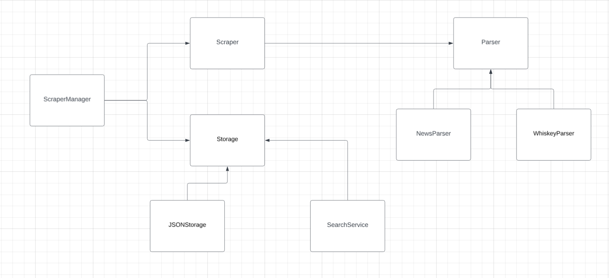

# Matrix Scraper using Selenium

This project implements a versatile and extendable web scraping system, designed to extract data from websites such as government news portals and online stores. It uses **Selenium** for web automation, efficiently fetching, parsing, and storing data such as news articles and product information in a structured JSON format.

## Challenge

In this project, a key challenge was handling dynamic content that is loaded asynchronously via JavaScript, such as infinite scrolling on the whiskey store or articles loading on the news site. To address this, **Selenium** was used to interact with the page as a real user would, allowing for the execution of JavaScript to load additional content. For example, scrolling was automated with `window.scrollTo(0, document.body.scrollHeight);` to trigger more data to load. Additionally, explicit waits ensured the content was fully loaded before scraping, making the extraction of dynamic data seamless.


## Features

- **Dynamic Web Scraping**: Uses Selenium WebDriver to automate the scraping of dynamic content from various websites.
- **News Article Extraction**: Extracts titles, content, publish dates, tags, and metadata from articles on government websites.
- **Product Data Extraction**: Scrapes product information, such as whiskey bottle details, from e-commerce stores.
- **Headless Mode**: Optimizes scraping performance by running in headless mode, minimizing resource consumption.
- **Modular Architecture**: Follows the **Factory Design Pattern** to easily add support for new websites by implementing new parser modules.
- **Regex URL Extraction**: Uses regular expressions to extract structured data from raw HTML, making the scraping process flexible and adaptable.
- **JSON Storage**: Saves scraped data in structured JSON format, with efficient handling of duplicates and storage management.
- **Search Functionality**: Supports searching for specific words or phrases across saved articles and product data.

## Project Structure

- **Parsers**: Custom parsers for each website are implemented in dedicated modules (`news_parser.py`, `whiskey_parser.py`) following a common interface for easy extensibility.
- **Scraper Management**: The scraping process is managed by `scraper_manager.py`, which orchestrates the parsers and storage solutions.
- **Storage**: Data is saved in JSON format using `json_storage.py`, ensuring no duplicate entries.
- **Search Service**: `search_service.py` provides the ability to search for terms across the stored data, making it easy to locate specific information.



## Requirements

- **Google Chrome** (Version: `129.0.6668.59 (Official Build) (arm64)`)
- **ChromeDriver** (Version: `129.0.6668.58`)
- **Python** `3.7+`
- **Selenium** `4.0+`
- Additional Python packages listed in the `requirements.txt`.

## Installation

### Step 1: Install Google Chrome

Ensure you have Google Chrome installed. The tested version for this project is:

- **Chrome Version**: `129.0.6668.59 (Official Build) (arm64)`

Make sure your Chrome version matches the corresponding ChromeDriver version.

### Step 2: Install ChromeDriver

You must install ChromeDriver version `129.0.6668.58` to match your Chrome browser version. You can download it from the [official ChromeDriver site](https://chromedriver.chromium.org/downloads).

For **Mac (arm64)**:
```bash
wget https://chromedriver.storage.googleapis.com/129.0.6668.58/chromedriver_mac64.zip
unzip chromedriver_mac64.zip
sudo mv chromedriver /usr/local/bin/chromedriver
```

### Step 3: Set Up a Virtual Environment

It is highly recommended to use a virtual environment to isolate project dependencies. To create and activate a virtual environment, run:

```bash
# Install virtualenv if not installed
pip install virtualenv

# Create a virtual environment
virtualenv venv

# Activate the virtual environment
source venv/bin/activate
```

### Step 4: Install Dependencies

Once the virtual environment is active, install the required Python packages listed in the `requirements.txt` file:

```bash
pip install -r requirements.txt
```

### Step 5: Set Up Environment Variables (Optional)

If needed, you can configure environment variables for specific settings like paths or API keys. You can use a `.env` file or directly export them in your terminal session.

## Usage

### Running the Scraper

To run the scraper for either the news articles or the whiskey product data, you can execute the `main.py` script. Here’s an example of how to run the scraper:

```bash
python main.py --url "https://www.gov.il/en/collectors/news" --parser "news"
```

This will run the scraper for the specified site and URL, storing the scraped data in the specified storage system.

### Example for Whiskey Store:

```bash
python main.py --url "https://www.paneco.co.il/whiskey" --parser "whiskey"
```

The scraper will fetch whiskey bottle details and save them as JSON files.

### Searching Data

Once data is scraped and stored, you can search for specific terms using the search service. Here's an example command to search for the word `whiskey` across stored JSON files:

```bash
python main.py --search "מילק" --url "https://www.paneco.co.il/whiskey" --parser "whiskey"
```